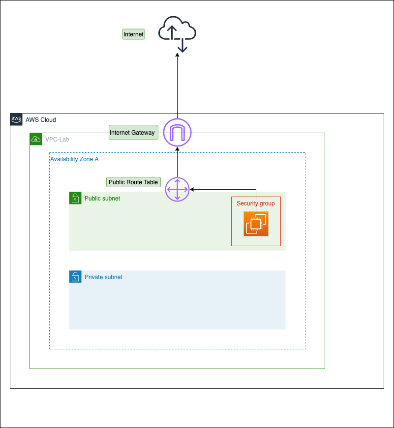

# VPC Lab



## Prerequisites

Before you start, you need to generate SSH-keys for instances in Public and Private subnets.
By default, keys are stored in files: 

- _./terraform/files/vpc-lab-public_
- _./terraform/files/vpc-lab-private_

but you can override their paths via the corresponding variables:

- _key_public_path_
- _key_private_path_

## Run the Lab

```bash
cd terraform
terraform init
terraform plan
terraform apply
```
